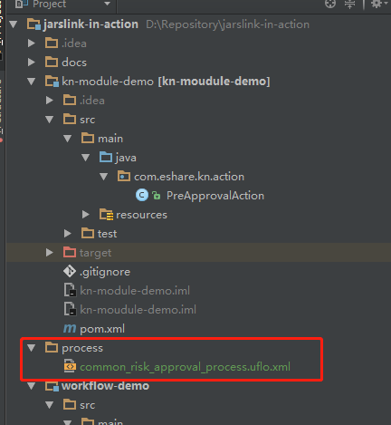
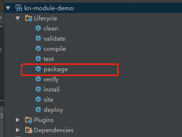
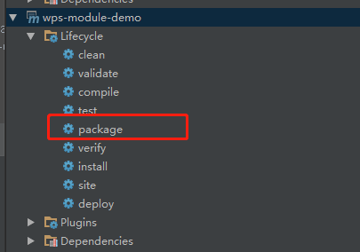
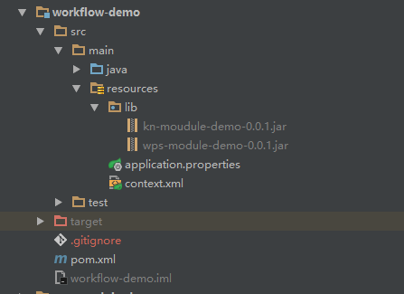
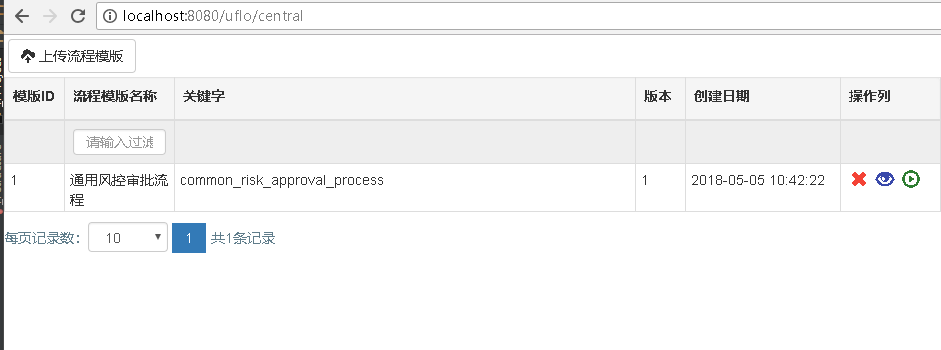
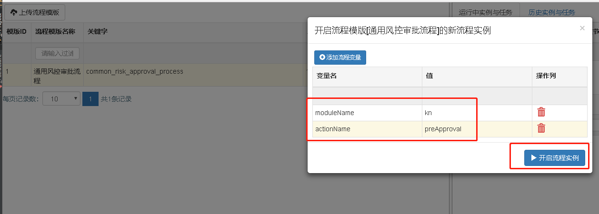
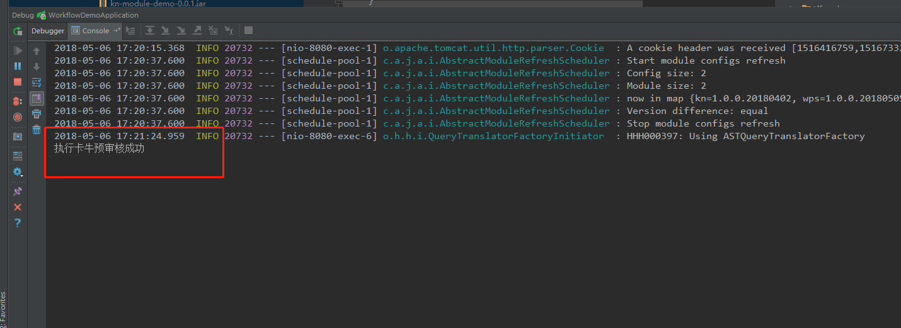

# **Guideline**

## **Module**

> workflow-demo The main module used to load jar

> kn-module-demo The jar module used to execute the approval logic for Kn product

> wps-module-demo The jar module used to execute the approval logic for wps product

***

## **How to use**

1.Package the module demo to the lib forder in workflow-demo and run the Main class.

**For example:**

I want to use the kn-module-demo and wps-module-demo.

Step:

- Create a forlder named "process" in root of "D" disk and copy the workflow tempalte
to "process" in "D" disk from the "process" folder in project.

- Use "mvn package" command to generate the jar and rename to
"kn-moudule-demo-0.0.1.jar" or "wps-module-demo-0.0.1.jar"

- Copy JARS to lib forder in "workflow-demo"

- Run "WorkflowDemoApplication" in workflow-demo

- Input the URL "localhost:8080/uflo/central" in browser and request,you'll see
bellow workflow consol.

- Run the worflow template by "Run" button  and
input the parameters as flowing:

- Click "Run" button  to request

- You can see the execution log showed in the console

***

## WORKING PRINCIPLE

